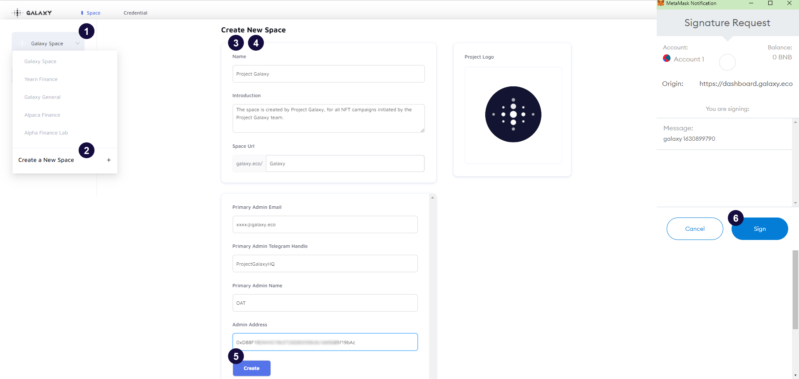

# Step 1 - Create a Space

## Create your dedicated space on Galxe

1. Click "Galxe Space" from the left dropdown list
2. Select "Create a New Space" to create a new space.
3. Fill up the space information accordingly (*Introduction refers to Protocol/Project Description)
4. Fill up the primary admin information (Primary Admin of Protocol/Project)
5. Click "Create"
6. Confirm to create space by clicking "Sign" on the signature request

## Update Space Info

- After the space is created, the user can check all the information in their accessible spaces.
- All information can be updated by clicking the respective feature (Name, Logo, etc.).
- The primary admin can add additional admins to the space. The additional admin addresses will have the same access as the primary admin (Including all-access such as update/delete/retrieve/create).

## Add / Remove Admin

1. Click the "Admin wallet address" feature
2. Input the additional admin wallet address and select "+"
3. Remove existing admin wallet address by selecting "x"
4. Click "Update"
5. Confirm to update the information by clicking "Sign" on the signature request

## Tutorial Video for Creating Space

[https://youtu.be/MDS5k6I6Z28](https://youtu.be/MDS5k6I6Z28)
