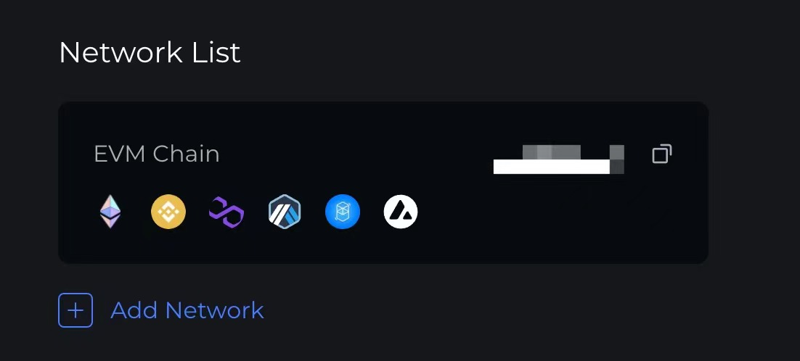
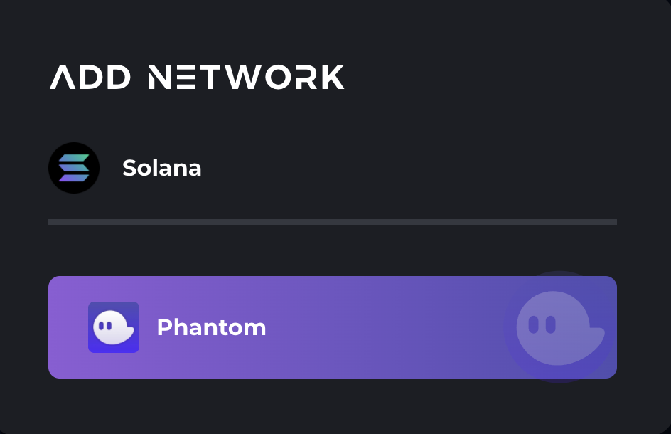

# Link your Solana Wallet to Galxe ID

## Step 1: Set up your Phantom Wallet if you haven’t done so

Currently Galxe supports Phantom Wallet on Solana.

---

Visit **[https://phantom.app/download](https://phantom.app/download)** and select your browser type. Follow steps in your respective extension store to add Phantom to your browser. After installing, you should see Phantom start up in a new tab:

If you are a brand new Solana user, select "**Create New Wallet**". If you are an existing Solana user coming from sollet, you can follow steps **[here](https://phantom.app/help/migrating-from-sollet-to-phantom)** to migrate your existing wallets to Phantom.

Store your "**Secret Recovery Phrase**" in a safe and secure location, it is the only way to recover your wallet. At no point will a member of the Phantom team ever ask you for this phrase. Whoever has access to this phrase has access to your funds.

Look for the Phantom icon in your browser's toolbar.

If you are using Chrome, it will be in the top right hand side of your browser. If you don't see it look for a "puzzle piece" icon and click on it to access a list of installed extensions. There you should find Phantom, click on the "pin icon" to make it easier to find in the future.

## Step 2: Link Phantom Wallet to your Galxe ID

---

1. Visit [https://galxe.com/accountSetting](https://galxe.com/accountSetting)
2. Connect your wallet with your existing account
3. In the Network List section, click “Add Network”

    

4. Click Phantom Wallet to link it with your Solana Address

    

5. Approve the signature requests on your Phantom Wallet and Metamask Wallet.
6. Congrats! Now your Galxe ID support both EVM Chain and Solana!

