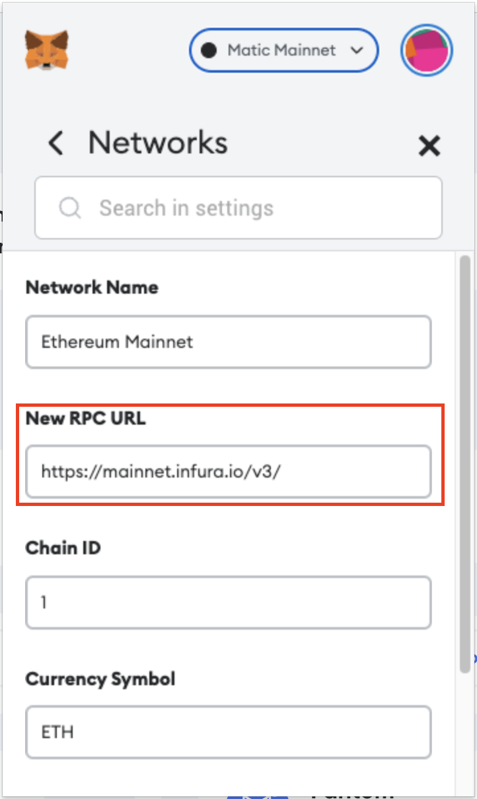

## Option 1: Switch your wallet to a different blockchain and then switch back to the original.

---
Try to switch your wallet to a different blockchain and then switch back to the original one to see if the error is fixed.

## Option 2: Change your blockchain rpc endpoint to a custom one.

---
Go to Settings > Network > The network you are using > New RPC URL. Paste the custom rpc endpoint into the text box. You can find the public available rpc endpoints on [ankr public rpc](https://www.ankr.com/protocol).

---
If you are still having problems, please ask our support for help.