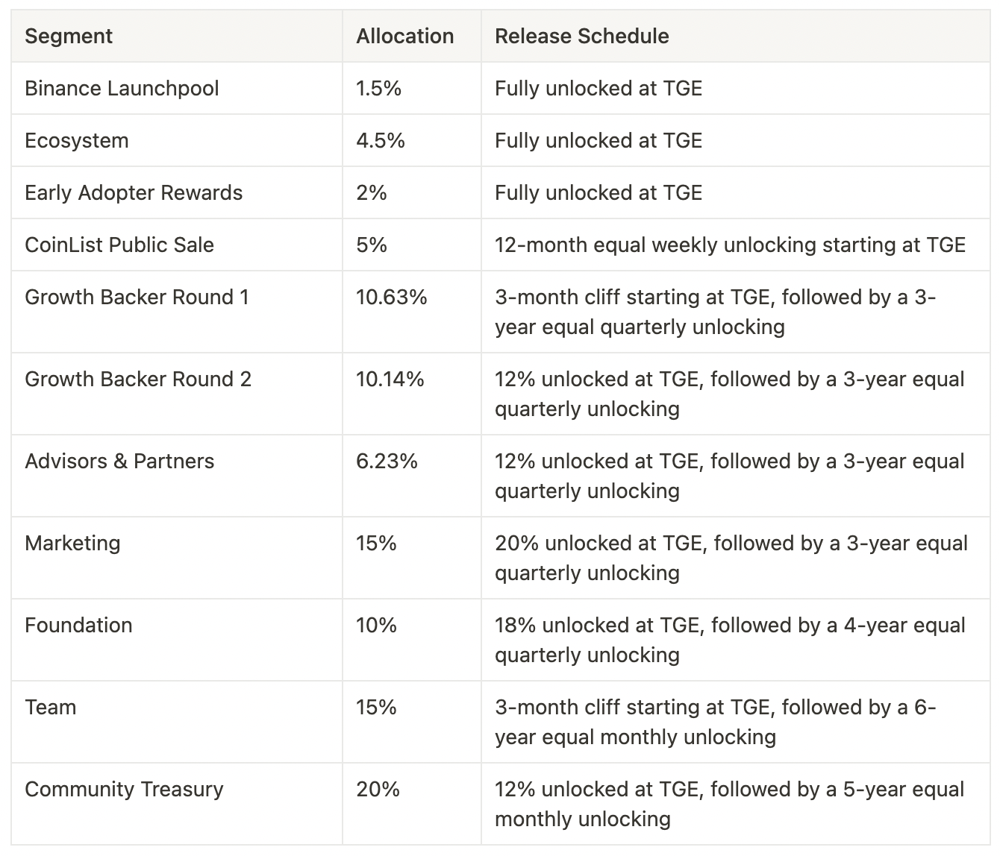

# GAL Token

> ERC20 Token Address: **0x5fAa989Af96Af85384b8a938c2EdE4A7378D9875**

> BEP20 Token Address: **0xe4Cc45Bb5DBDA06dB6183E8bf016569f40497Aa5**

Project Galaxy aims to build a permissionless, open, and collaborative credential data network. The GAL token is an essential component to such infrastructures as it functions as the governance token, incentivizes user participation, and serves as the primary payment token of the Project Galaxy ecosystem. Here are the utilities of GAL:

- **Governance:** GAL is used for voting & governance in Project Galaxy DAO. GAL token holders have the ability to control the amount of the platform fee collected by the protocol, and control funds held by the Project Galaxy Community Treasury.
- **Paying for Application Module Fee:** Developers who aim to utilize Galaxy’s credential data through Application Modules will be subject to a Platform Fee which is charged in GAL. The Platform Fee is set up such that every interaction with the Galaxy Protocol will incur a fee in GAL. Most of the fee will go to the curators, and Galaxy Community Treasury will collect the rest. Currently all Application Modules fees are waived during beta testing.
- **Paying for Galaxy Oracle Engine and Galaxy Credential API:** Developers pay GAL to query our credential data through Galaxy Oracle Engine and Galaxy Credential API. Currently all query fees are waived during beta testing.
- **Curating Digital Credentials:** Curators can utilize the GAL token to signal a credential data set’s value. Each credential data set will include a revenue stream that will be split between credential stake holders pro-rata. Curators can purchase stakes of a credential data set from its corresponding bonding curve. Because of the nature of the bonding curve(price of credential stake increases as more users purchase it), in the event a curator purchases the credential stake of a popular data set early, the cost of credential stakes will be low so its future revenue stream will be relatively high. When the price of the credential stake increases along the bonding curve, the curators can also choose to sell the credential stakes back to the bonding curve in exchange for GAL. As a result, this incentivizes curators to help identify valuable credential data sets by using GAL to exchange for credential stakes through the bonding curves. In the long term, the more credential data in the network, the more GAL will be locked in bonding curves for data signaling. Currently the curation system is still under development.

# Token Distribution

GAL has a total supply of 200,000,000 tokens.
Here is a breakdown on how these tokens will be distributed.

