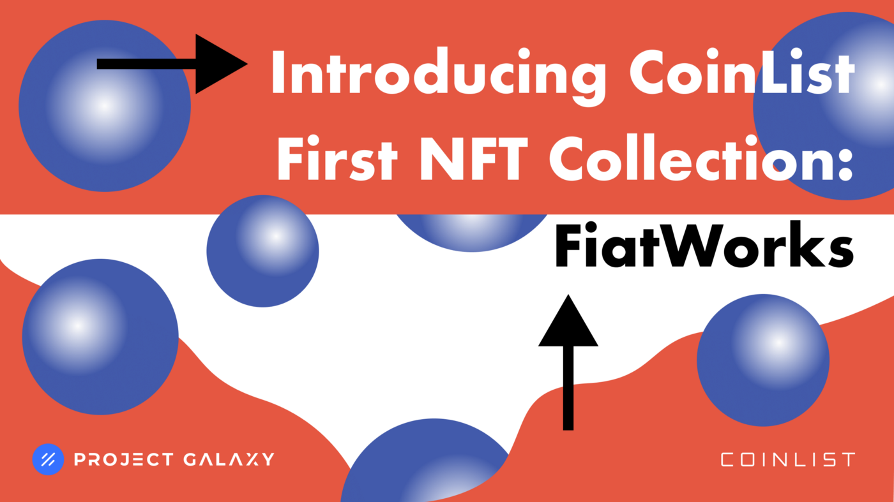

# Case Study: CoinList

### FIAT Works Campaign

CoinList Friends & Karma Guru

## Challenge

[CoinList](https://twitter.com/CoinList) is a trusted platform for new crypto offerings that accelerates the advancement of blockchain technology. 

CoinList approached Project Galaxy with the idea of launching their very first NFT Collection in December 2021 entitled [“FiatWorks”](https://blog.galaxy.eco/colinlist-takes-its-first-nft-collection-to-the-galaxy-e2393cefbe2). They wanted to reward their loyal fanbase by creating two campaigns that would incentivize engagement and web traffic. CoinList also wanted to give back to their community that had supported them throughout 2021 and were looking for Project Galaxy to make that happen.

## Solution

To obtain CoinList’s goal of launching their first ever NFT Collection, Project Galaxy powered a stunning NFT Campaign with artwork commissioned by an artist and creative technologist named Case Simmons. Simmons created a limited edition collection of 3,000 programmatically generated NFTs. His work has previously been exhibited internationally at the Guggenheim Museum in New York, the Jumex Collection in Mexico City, the Me Collectors Room in Berlin and most recently the Los Angeles County Museum of Art.

Project Galaxy also implemented an exclusive content module for this campaign which allowed credential-based NFT issuers to add exclusive content in the NFT that is only viewable by the NFT holders.

The FiatWorks NFT collection was released to two groups of users: 

1. **[Karma Gurus:](https://galaxy.eco/coinlist/campaign/GC2KYUUpqT)**
    Karma Gurus is a group of 3,000 CoinList users that have accumulated the highest CoinList Karma score from this year’s eligible categories.
2. **[CoinList Friends:**](https://galaxy.eco/coinlist/campaign/GCAQYUUoVG) 222 FiatWorks NFTs will be allocated for friends, partners, and evangelists of CoinList without whom none of what CoinList, and the token networks on CoinList, accomplished in 2021 would be possible.

## Result

This campaign was a massive success with 2,631 Karma Guru NFTs minted and 98 CoinList Friends NFTs minted.