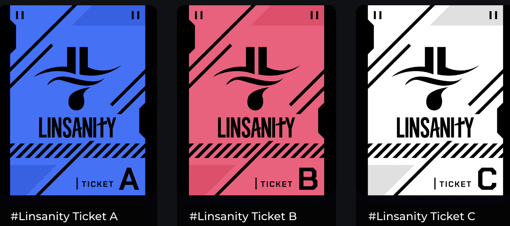

# Case Study: The Linsanity Campaign

## Challenge

[REEL8](https://twitter.com/goreel8) is the leading NFT marketplace for exclusive film moments. Their passion for Asian-American film creators allow fans to browse and collect exclusive, limited-edition, and never-before-seen moments from their favorite film creators. With the goal of personal expression, community membership, and fandom, REEL8 is imaging a new NFT future.

When REEL8 and [Jeremy Lin](https://twitter.com/JLin7) approached [Project Galaxy](https://twitter.com/ProjectGalaxyHQ) for a collaboration, they were looking for brand awareness to kickstart their [film NFTs for the “Linsanity” documentary](https://blog.galaxy.eco/introducing-jeremy-lin-nfts-presented-by-reel8-on-project-galaxy-31cb37da7bb4). This was a brand new project that desired user growth and engagement which Project Galaxy was more than happy to provide. The NFTs featured access to unreleased director’s cuts and behind-the-scenes footage of the Lin family documentary. Along with exclusive content, these NFTs also gave fans the opportunity to unlock exclusive Metaverse rewards such as a high-stakes three-point shooting game, through which NFT-holders could meet Jeremy Lin within a live AMA.

## Solution

To obtain REEL8’s goal of brand awareness, Project Galaxy [powered this NFT Campaign](https://galaxy.eco/Reel8/) and marketed it to our loyal user base. We created a campaign that included a multitude of different tasks. These tasks would allow for participants to access their Linsanity allowlist spot. For example, users accomplished social media tasks by following Jeremy Lin, Reel 8 and Project Galaxy on Twitter and Instagram. Other tasks had fans engaging in more active ways with quizzes on Jeremy Lin’s Instagram stories and an AMA series (Ask me Anything) on Twitter and Discord.

100% of Lin’s sale proceeds benefited the [Jeremy Lin Foundation](https://twitter.com/jlinfoundation) which supports overlooked and underserved AAPI (Asian American Pacific Islander) and cross-racial youth programs through narrative change, community empowerment, and cross-racial solidarity.

## Result

The campaign had great success with thousands of users engaging in the tasks and minting coveted Linsanity allowlist vouchers.

1. Dropping Dimes : By doing tasks, people gained access to a Mystery Box that distributed Tickets A, B, or C. A total of 90,893 NFTs were minted.

   
2. VIP/VVIP: Participants gained either VIP or VVIP access depending on the number of A and B passes collected in the Mystery Box. VIP accesses ensured number one priority to the mint while VVIP ensured number two access. A total of 333 VIP NFTs and 3,199 VVIP NFTs were minted.