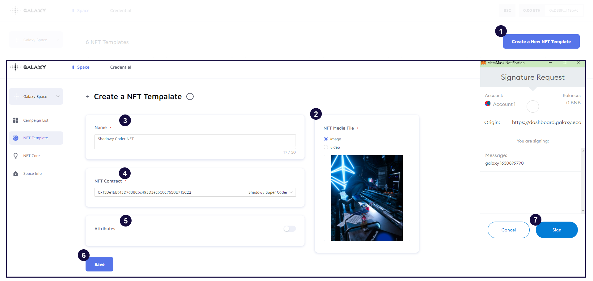

# Step 4 - Upload an NFT Template

## What is NFT Template?

- Once the NFT Core has been created, users can upload the NFT design to the NFT template, which can later used for campaigns.
- Each NFT Core can create multiple NFT and the NFT could be in image or video format.
- If the NFT collection has attributes, please provide Galaxy the metadata using the [OpenSea standard](https://docs.opensea.io/docs/metadata-standards) in JSON file or you may use [this](https://docs.google.com/spreadsheets/d/1r-yoW7AWHHJgU-byVyYR78W68SXVF6DQ/edit#gid=1378905338) spreadsheet template. (Image, name, attributes are required and others are optional.)

## Create an NFT Template

1. Click "Create a New NFT Template"
2. Select the file format under "NFT Media File" and upload the image or video (Image/Video size, recommended 5:6)
3. Fill up the name of an NFT (For e.g. Shadowy Coder NFT)
4. Select the respective NFT Core
5. If needed, turn on the "Attribute" and add the "Name" and "Value"
6. Click "Save"
7. Confirm to create the NFT template by clicking "Sign" on the signature request

## Tutorial Video for NFT Template

[https://youtu.be/NEk659syQ-w](https://youtu.be/NEk659syQ-w)
