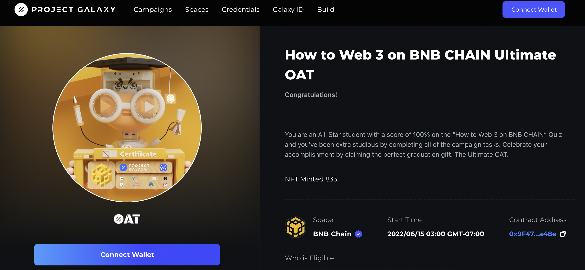

# Case Study: How to Web3 on BNB Chain
## Challenge

[BNB](assets/how-to-web3-bnb.png) Chain is an infrastructure which was created to help developers build and run their blockchains. They are passionate about building a focused value system for a massive number of users while still maintaining a close connection with the BNB Chain.

BNB Chain reached out to [Galxe](https://twitter.com/GalxeHQ) because they wanted to create an influx of community engagement through the integration of the BNB Chain to Galxe. BNB Chain wanted to offer users the chance to explore and try out the BNB Chain in a learn-to-earn campaign with tons of rewards/prizes. With the rise in blockchain technologies, the trend is migrating from Web2 to Web3 so Galxe was more than up to this challenge.

## Solution

Galxe is no stranger when it comes to introducing new chains to its users. In 2021, we launched the Ethereum-based course [“DeFi 101” NFT Campaign](https://blog.galxe.com/coingecko-introduces-defi-101-nft-campaign-on-project-galaxy-4bdae4f0f539) in collaboration with [CoinGecko](https://galxe.com/coingecko) which rewarded users for learning about Web3 with honor badges. Back in January 2022, we grew the Solana ecosystem with the [SOL Cool](https://blog.galxe.com/project-galaxy-sol-cool-2022-event-recap-8e40f066a00b) event which was an inclusive multi-chain campaign that brought together 27 protocols in one massive campaign.

To obtain BNB Chain’s goal of user engagement, Galxe helped power an earn-to-learn program involving 9 secret projects. The program hosted by [BNB Chain](https://twitter.com/BNBCHAIN), presented by [CoinMarketCap](https://twitter.com/CoinMarketCap), and powered by [Galxe](https://twitter.com/GalxeHQ) had a total of 9 projects and protocols come together to make this dream a reality. Each project hosted a lesson on the CoinMarketCap earn program which was then followed by a quiz. After completing each lesson and quiz on CoinMarketCap Earn, users could complete additional homework which allowed them to claim an OAT (On-Chain Achievement Token) NFT Badge on Galxe.

## Results

Altogether, the protocols had over 400K worth of prizes available in NFTs and Tokens. The prize incentives helped attract over 150,052 overall users with 49,279 OATs claimed and 240,635 page views.
